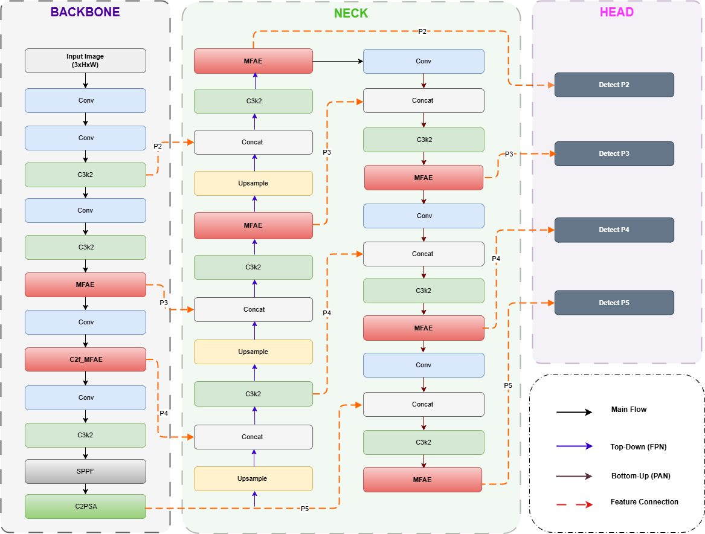
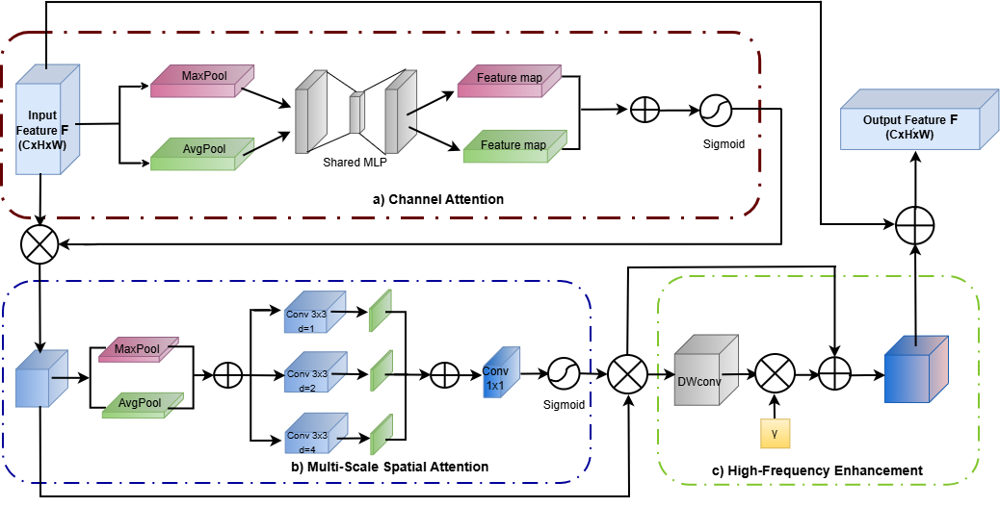
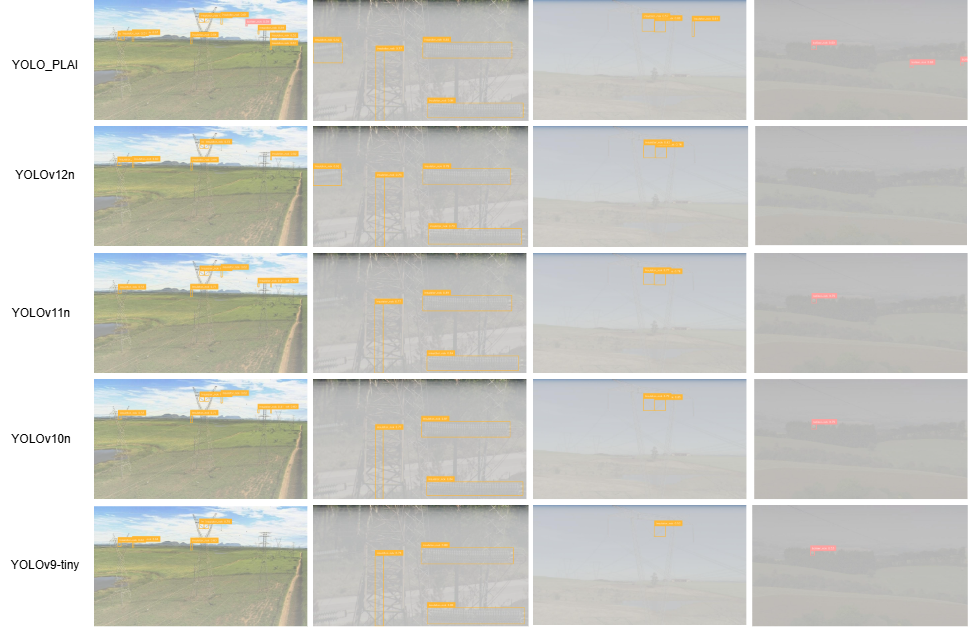

<div align="center">

# PLAI-YOLO

### PLAI-YOLO: YOLO-PLAI: An Enhanced YOLOv12 Framework for Power Line Autonomous Inspection 

<p align="center">
  <br>
  <sub><b>Figure 1.</b> Overall architecture of the proposed YOLO-PLAI model</sub>
</p>

<br>

<p align="center">
  <br>
  <sub><b>Figure 2.</b> The architecture of the MFAE module</sub>
</p>

<br>

<p align="center">
  <br>
  <sub><b>Figure 3.</b> Qualitative comparison of detection results against four competing methods on the combined haze dataset</sub>
</p>

</div>

---
# Installation

> [!IMPORTANT]
> Python **3.11** is recommended for running this project.
>
> Using Python **3.11.x** helps ensure compatibility among PyTorch, Ultralytics, CUDA, and the custom PLAI-YOLO modules.

---

## Option 1: Environment Setup with Conda

### Step 1: Create a Conda environment

```bash
conda create -n PLAI-YOLO python=3.11 -y
conda activate PLAI-YOLO
```

### Step 2: Clone the repository

```bash
git clone https://github.com/val-utehy/PLAI-YOLO.git
cd PLAI-YOLO
```

> [!NOTE]
> This repository is private. Make sure your GitHub account has permission to access it before cloning.

### Step 3: Install the required dependencies

```bash
pip install ultralytics
```

---

## Option 2: Environment Setup with Python venv

Make sure Python 3.11 is available:

```bash
python3.11 --version
```

### Step 1: Create a virtual environment

```bash
python3.11 -m venv PLAI-YOLO
```

### Step 2: Activate the environment

Linux or macOS:

```bash
source PLAI-YOLO/bin/activate
```

Windows Command Prompt:

```bash
PLAI-YOLO\Scripts\activate
```

Windows PowerShell:

```powershell
PLAI-YOLO\Scripts\Activate.ps1
```

### Step 3: Install Ultralytics

Install the Ultralytics package in the activated environment:

```bash
pip install ultralytics
```

---

## Verify the Environment

After installation, verify the Python, PyTorch, and Ultralytics installations:

```bash
python --version
pip show torch
pip show ultralytics
```

Check whether CUDA is available:

```bash
python -c "import torch; print('PyTorch:', torch.__version__); print('CUDA available:', torch.cuda.is_available()); print('CUDA version:', torch.version.cuda)"
```

---

## Option 1: Validation with the Python API

The model can be evaluated directly through the Ultralytics Python interface:

```python
import sys
from pathlib import Path

sys.path.insert(0, str(Path(__file__).parent))

import modules
import torch
from ultralytics import YOLO


weights_path = "best.pt"
data_path = "data_23_04_26.yaml"

device = 0 if torch.cuda.is_available() else "cpu"

model = YOLO(weights_path)

metrics = model.val(
    data=data_path,
    split="test",
    imgsz=640,
    conf=0.001,
    iou=0.60,
    device=device,
    augment=True,
    verbose=False
)

precision = float(metrics.box.mp)
recall = float(metrics.box.mr)
f1_score = 2 * precision * recall / (precision + recall + 1e-9)

print("=" * 60)
print("PLAI-YOLO Evaluation Results")
print("=" * 60)
print(f"mAP@0.50:      {metrics.box.map50:.4f}")
print(f"mAP@0.50:0.95: {metrics.box.map:.4f}")
print(f"Precision:     {precision:.4f}")
print(f"Recall:        {recall:.4f}")
print(f"F1-score:      {f1_score:.4f}")
print("=" * 60)
```

The `modules` package must be imported before loading the checkpoint so that the custom PLAI-YOLO components are registered correctly.

---

## Option 2: Validation with `eval.py`

Run evaluation with the default settings:

```bash
python eval.py
```

Example with custom parameters:

```bash
python eval.py \
  --weights best.pt \
  --data path/to/data.yaml \
  --split test \
  --imgsz 640 800 \
  --conf 0.001 \
  --iou 0.6 \
  --device auto \
  --target-map50 0.54
```

Test-Time Augmentation is enabled by default. Use `--no-tta` to disable it:

```bash
python eval.py --imgsz 640 --no-tta
```

### Arguments

| Argument | Default | Description |
|---|---:|---|
| `--weights` | `best.pt` | Path to the model checkpoint |
| `--data` | `data_23_04_26.yaml` | Path to the dataset YAML file |
| `--split` | `test` | Dataset split: `train`, `val`, or `test` |
| `--imgsz` | `640 800` | One or more evaluation image sizes |
| `--conf` | `0.001` | Confidence threshold |
| `--iou` | `0.6` | IoU threshold |
| `--no-tta` | Disabled | Disable Test-Time Augmentation |
| `--device` | `auto` | Device: `auto`, `cpu`, `0`, `1`, etc. |
| `--target-map50` | `0.54` | Target mAP@0.50 for result comparison |


# Inference

PLAI-YOLO inference can also be executed through either the Python API or the provided command-line script.

---

## Option 1: Inference with the Python API

```python
import sys
from pathlib import Path

sys.path.insert(0, str(Path(__file__).parent))

import modules
import torch
from ultralytics import YOLO


weights_path = "best.pt"
source_path = "path/to/image_or_folder"

device = 0 if torch.cuda.is_available() else "cpu"

model = YOLO(weights_path)

results = model.predict(
    source=source_path,
    imgsz=640,
    conf=0.25,
    iou=0.45,
    device=device,
    save=True,
    project="runs",
    name="predict",
    exist_ok=True,
    verbose=False
)

total_detections = sum(len(result.boxes) for result in results)

print(f"Processed {len(results)} input item(s).")
print(f"Total detections: {total_detections}")

if results:
    print(f"Results saved to: {results[0].save_dir}")
```

Replace:

```text
path/to/image_or_folder
```

with the path to an image, image directory, or video.

---

## Option 2: Inference with `inference.py`

Run inference by passing the input path through the required `--source` argument:

```bash
python inference.py --source path/to/image_or_folder
```

Example with custom parameters:

```bash
python inference.py \
  --weights best.pt \
  --source path/to/images \
  --imgsz 640 \
  --conf 0.25 \
  --iou 0.45 \
  --device auto \
  --save-dir runs/predict
```

### Arguments

| Argument | Default | Description |
|---|---:|---|
| `--weights` | `best.pt` | Path to the model checkpoint |
| `--source` | Required | Path to an image, image directory, or video |
| `--imgsz` | `640` | Input image size |
| `--conf` | `0.25` | Confidence threshold |
| `--iou` | `0.45` | IoU threshold |
| `--device` | `auto` | Device: `auto`, `cpu`, `0`, `1`, etc. |
| `--save-dir` | `runs/predict` | Output directory |
| `--save-txt` | Disabled | Save predictions in YOLO text format |
| `--save-conf` | Disabled | Include confidence scores in saved labels |
| `--no-save-img` | Disabled | Do not save annotated images |
| `--show` | Disabled | Display prediction results |
---

# Model Export

The PLAI-YOLO checkpoint can be exported to several deployment formats through the Ultralytics export interface.

Because PLAI-YOLO contains custom modules, the `modules` package must be imported before the checkpoint is loaded.

---

## Export to ONNX

```python
import sys
from pathlib import Path

sys.path.insert(0, str(Path(__file__).parent))

import modules
from ultralytics import YOLO


model = YOLO("best.pt")

model.export(
    format="onnx",
    imgsz=640,
    simplify=True
)

print("PLAI-YOLO was exported to ONNX successfully.")
```

---

# Acknowledgement

The codebase is built upon Ultralytics, and THU-MIG/yolov10: https://github.com/THU-MIG/yolov10
We sincerely thank their contribution to the object detection community.

---
